# ⚡️🔋 Desafio SharEnergy ☀️🔌
> Desenvolvido por: Guilherme Augusto do Carmo Fernandes
> - Email: [gfengquimica@gmail.com](mailto:gfengquimica@gmail.com)
> - LinkedIn: https://www.linkedin.com/in/guilherme-ac-fernandes/
> - GitHub: https://github.com/guilherme-ac-fernandes
> - Portfolio: https://guilherme-ac-fernandes.vercel.app

<br />

Consiste em uma aplicação full-stack dockerizada capaz de realizar a comunicação com API's distintas e um backend contendo um CRUD de usuários.

<br />

### FrontEnd:
* Construído com React, React Hooks, Typescript, React-Icons, CSS e Docker
* Testes de integração com Jest e React Testing Library

Para realizar o login na aplicação, colocar as seguintes informações:

| `username` | `desafiosharenergy` |
|---|---|
| `password` | `sh@r3n3rgy` |

<br />
<details>
  <summary><strong>Cobertura de 98,52%</strong></summary><br />
  <p align="center">
    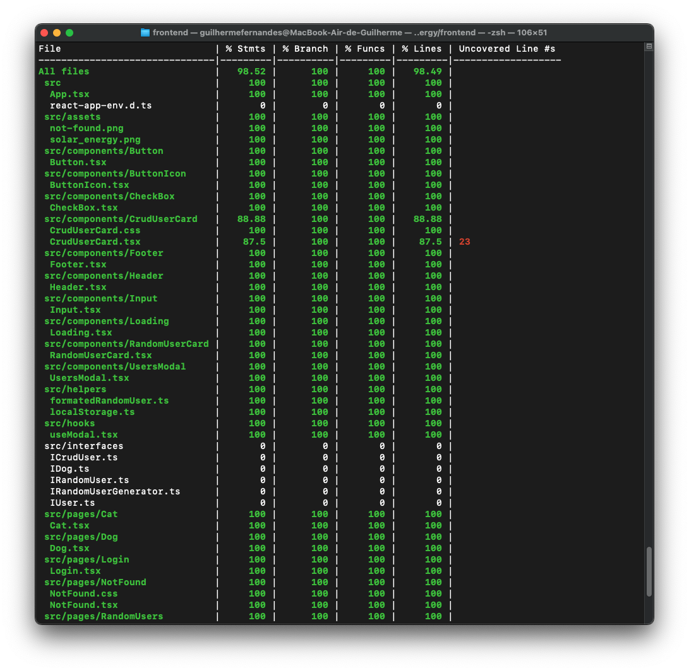
  </p>
</details>
<br />

### BackEnd:

* Construído com Node.js, Express, Typescript, Mongoose, MongoDB, Zod e Docker
* Utilizando os princípios SOLID e Programação Orientada a Objetos
* Aplicando Arquitetura de Software, com as camadas de Modelo, Serviço e de Controladores
* Testes unitários realizados com Mocha, Chai e Sinon

<br />
<details>
  <summary><strong>Cobertura de 98,55%</strong></summary><br />

  <p align="center">
    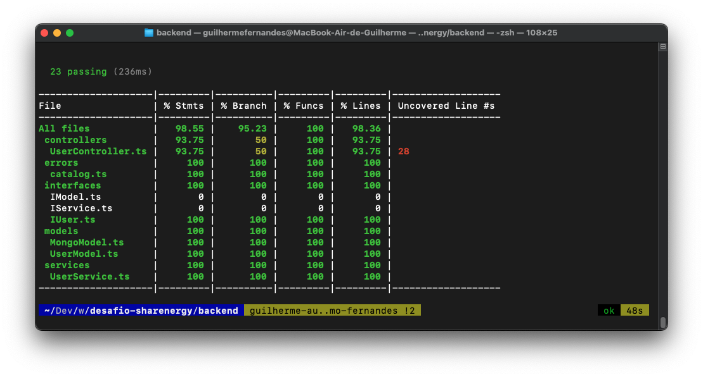
  </p>
</details>
<br />

### Instruções

- Para rodar a aplicação dockerizada, realize o clone do projeto e utilize os comandos a seguir:

```
<-- na raiz do projeto -->
npm run compose:up // subir os containers sem popular o banco de dados
ou
npm run compose:up:seed // subir os containers populando o banco de dados
```

A aplicação está disponível seguintes portas: [FrontEnd](http://localhost:3000/)(3000) e [BackEnd](http://localhost:3001/users)(3001)

**Observação:** caso realize o comando `npm run compose:up:seed`, o banco de dados é populado através do comando `mongoimport`, realizado durante a execução do container `mongo-seed`, caso aparece um erro (`"/users.json" not found: not found`), o comando move o arquivo, dentro da pasta `mongo-seed` se um arquivo de segurança, sugiro duplica-lo e renomea-lo para `users.json`.

<br />

- Para parar todos os container criados pelo docker, dependendo do comando utilizando para iniciar a aplicação dockerizada:

```
<-- na raiz do projeto -->
npm run compose:down
ou
npm run compose:down:seed
```

<br />


- Para rodar o testes do FrontEnd:

```
<-- na raiz do projeto -->
npm run front:acess
npm test // para rodar o teste simplificado
npm run test:coverage // para avaliar a cobertura dos testes
exit // para encerrar o terminal do container
```

<br />

- Para rodar o testes do BackEnd:

```
<-- na raiz do projeto -->
npm run back:acess
npm test // para rodar o teste simplificado
npm run test:coverage // para avaliar a cobertura dos testes
exit // para encerrar o terminal do container
```

<br />

### Endpoints

#### Usuários

| Método | Funcionalidade | URL |
|---|---|---|
| `GET` | Retorna todos os usuários cadastrados | http://localhost:3001/user |
| `GET` | Retorna os dados de um usuário específico | http://localhost:3001/user/id |
| `POST` | Cria um novo usuário | http://localhost:3001/user |
| `PUT` | Atualiza dados de um usuário existente | http://localhost:3001/user/id |
| `DELETE` | Apaga os dados de um usuário específico | http://localhost:3001/user/id |

<br />

Nas requisições POST e PUT é necessário informar o seguinte JSON:

```
{
  "name": "Harry Potter",
  "email": "harry_potter@wizard.com",
  "phoneNumber": "(31) 989898987",
  "address": "4 Privet Drive, Little Whinging, Surrey",
  "cpf": 56798723422
}
```

<br />
<details>
  <summary><strong>Demonstração FrontEnd - DeskTop</strong></summary><br />

  #### Tela de Login
  <p align="center">
    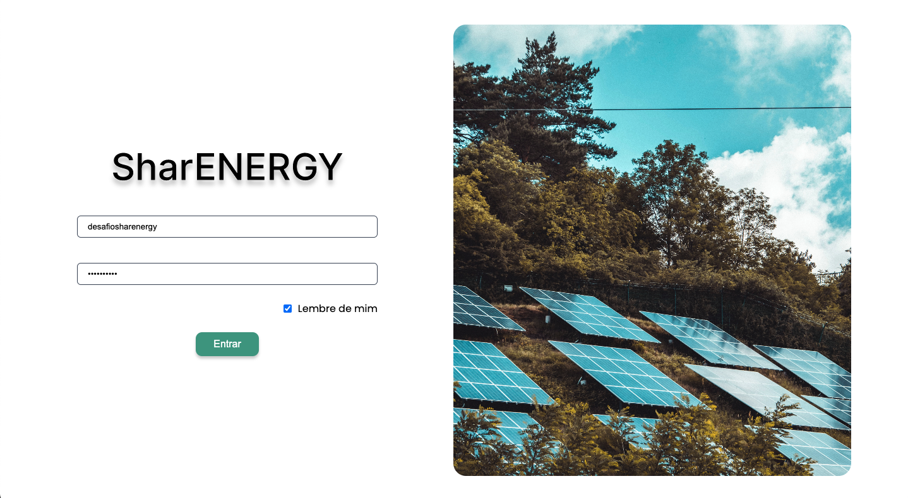
  </p>

  #### Tela de Usuários Aleatórios
  <p align="center">
    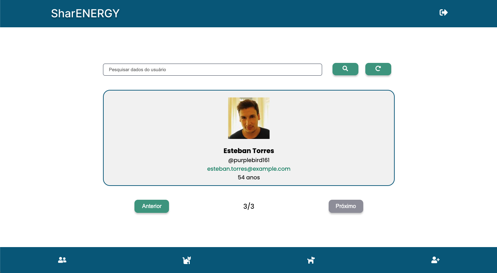
  </p>

  #### Tela de HTTP Gato
  <p align="center">
    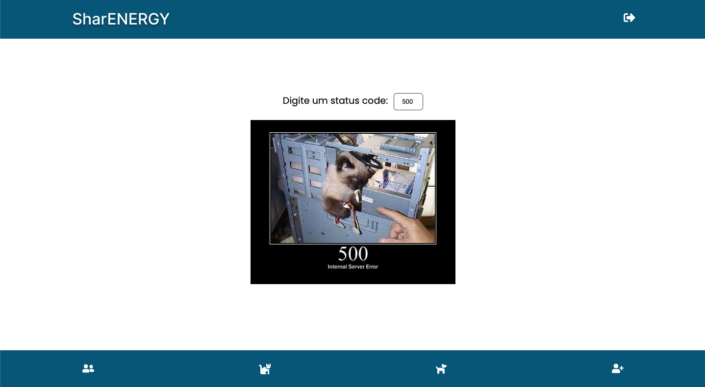
  </p>

  #### Tela de Cães Aleatórios
  <p align="center">
    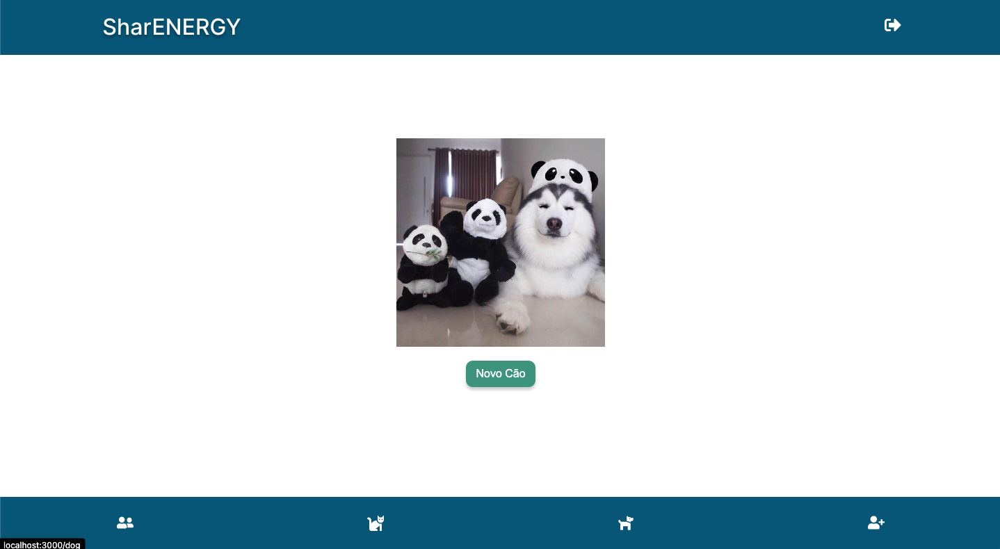
  </p>

  #### Tela para criação de Usuários
  <p align="center">
    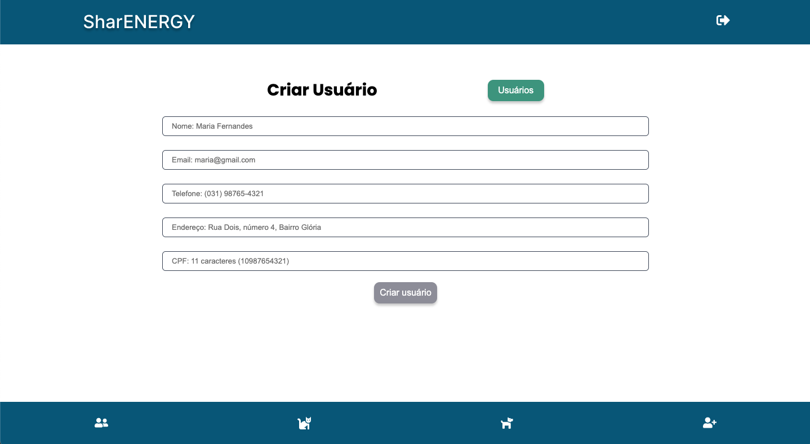
  </p>

  #### Tela de Usuários Criados
  <p align="center">
    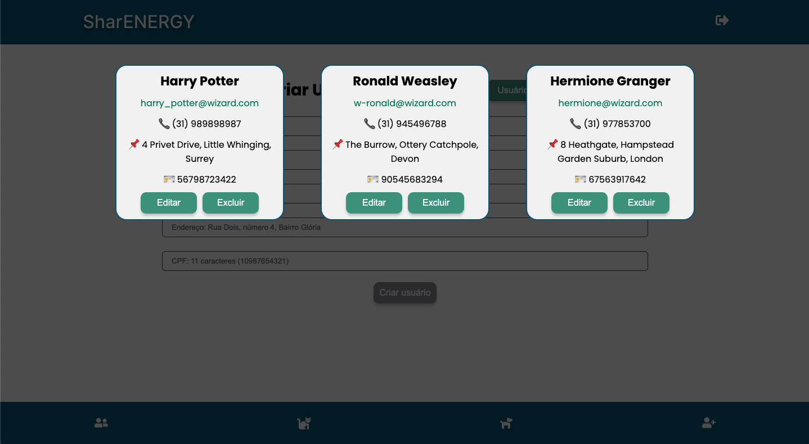
  </p>
</details>
<br />
<details>
  <summary><strong>Demonstração FrontEnd - Mobile</strong></summary><br />

  #### Tela de Login
  <p align="center">
    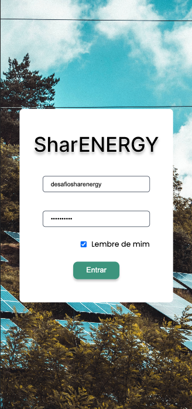
  </p>

  #### Tela de Usuários Aleatórios
  <p align="center">
    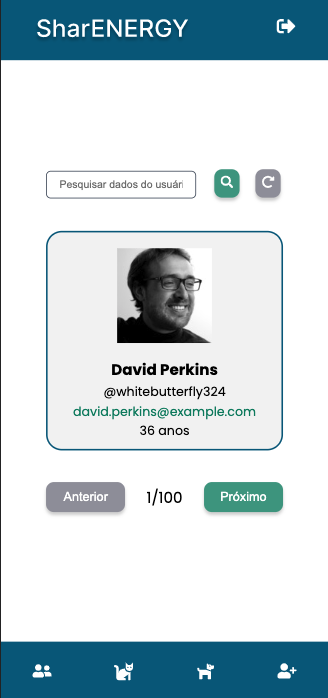
  </p>

  #### Tela de HTTP Gato
  <p align="center">
    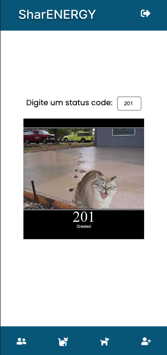
  </p>

  #### Tela de Cães Aleatórios
  <p align="center">
    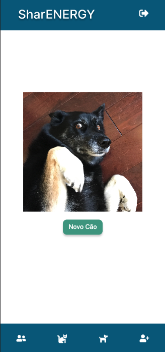
  </p>

  #### Tela para criação de Usuários
  <p align="center">
    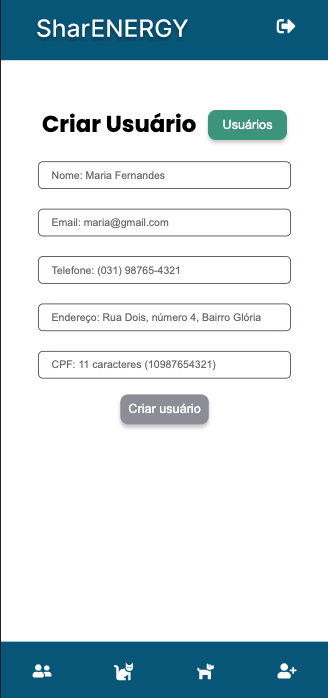
  </p>

  #### Tela de Usuários Criados
  <p align="center">
    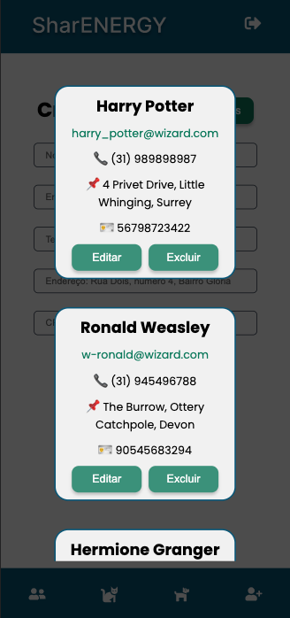
  </p>
</details>
